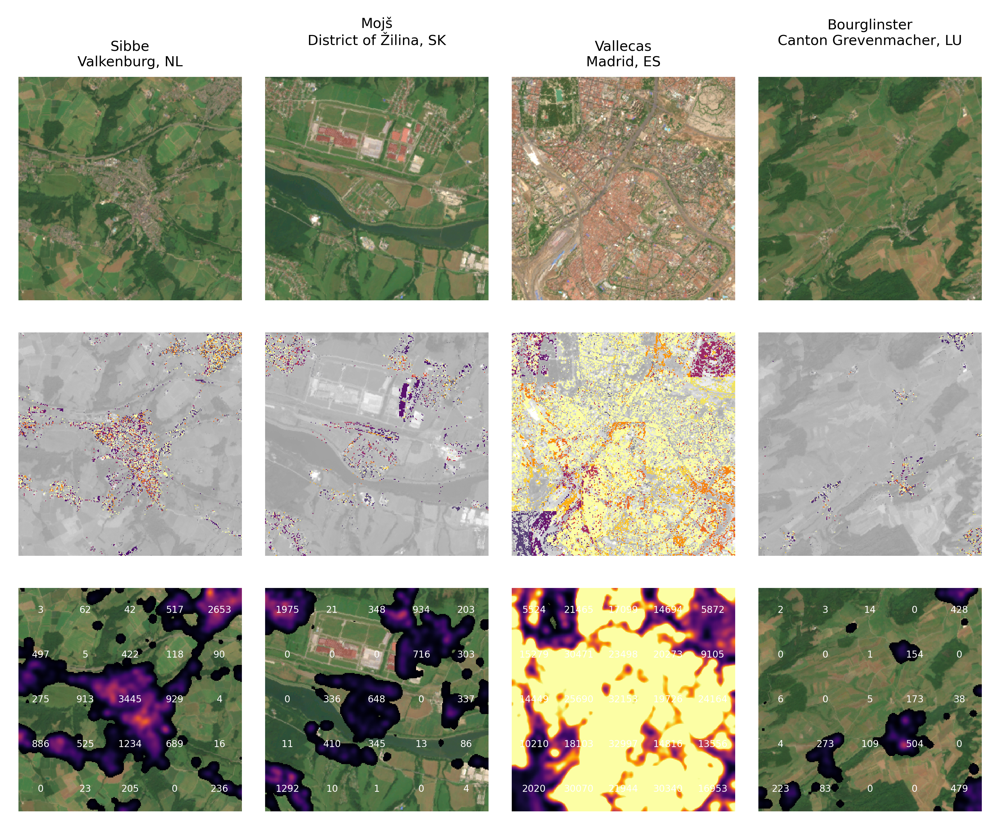

# pop_europe
A ML approach to figuring out where people live.

This code estimates the population density in high resolution over EU using sentinel-2 data supplemented with Sentinel-1 and nightlight data. 

I created this project as a starting point for two student groups who of an ML course. They have since worked more on the code and developed and tested alternative approaches. The students tested various CNN based approaches and variations on the clustering+regression approach in this project. The most promising of the CNN based results seemed to be based on ResNet-50. Unfortunately the CNN based approach cannot generate super-resolution outputs and is rather computationally expensive. For those reasons i prefer the simpler old school methods. 

The R2 of predicted population is ~0.67 for the best methods so far, which is not great. -But with "rescaling" this is still useful if you trust the coarse resolution census data used as inputs. The main difficulties seem to be extremely dense city centers and industrial areas. Idea: Possibly S1 backscatter data might help there as it could correlate with building height.

Feel free to contact me if you want to collaborate on this. 

Top row: S2 rgb
Middle row: per pixel pop density
Bottom row: pop density per ha (gaussian smooth of middle row)

# Input data: 
* Population density in 1km resolution from https://ec.europa.eu/eurostat/web/gisco/geodata/grids
* Sentinel-2 multiband images in 20m resolution.
* Sentinel-1 VV/VH images on same grid
* VIIRS Lunar Gap-Filled BRDF Nighttime Lights Daily (resampled to same grid.)

# Approach
* unsupervised clustering of S2 multiband (after a PCA/ICA transform)
* Bounded linear regression to determine the relative pop density in each cluster.
* (optional) rescale to force a match to census data.

# Scripts: 
* populationgrid.ipynb: script to convert the GISCO 1km population data to a geotiff.
* ee.ipynb: a script that downloads a set of random 5x5 km Sentinel-2 tiles in 20m resolution using earthengine. 
* Clustering: the script that does clustering and regression. 

