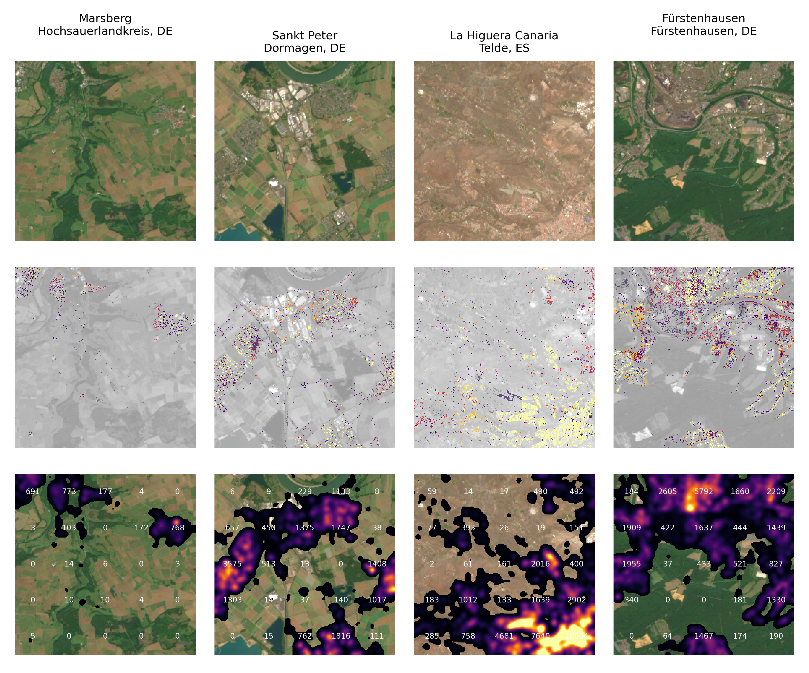

# pop_europe
A ML approach to figuring out where people live.

This code estimates the population density in high resolution over EU using sentinel-2 data. 

I created this as a starting point for a group of students who needed a nice project for an ML course. They have since worked more on the code and developed and tested alternative approaches. 

Feel free to contact me if you want to collaborate on this. 

Top row: S2 rgb
Middle row: per pixel pop density
Bottom row: pop density per ha (gaussian smooth of middle row)

# Input data: 
* population density in 1km resolution from https://ec.europa.eu/eurostat/web/gisco/geodata/grids
* Sentinel-2 multiband images in 20m resolution.

# Approach
* unsupervised clustering of S2 multiband (after a PCA/ICA transform)
* Bounded linear regression to determine the relative pop density in each cluster. 

# Scripts: 
* populationgrid.ipynb: script to convert the GISCO 1km population data to a geotiff.
* ee.ipynb: a script that downloads a set of random 5x5 km Sentinel-2 tiles in 20m resolution using earthengine. 
* Clustering: the script that does clustering and regression. 

